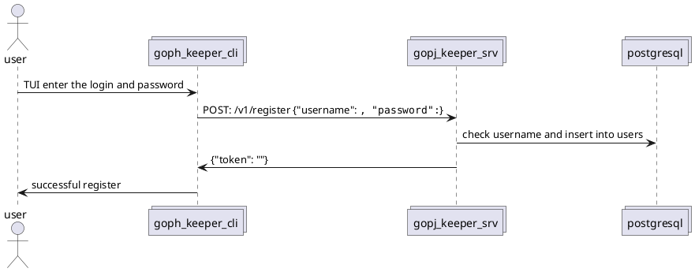
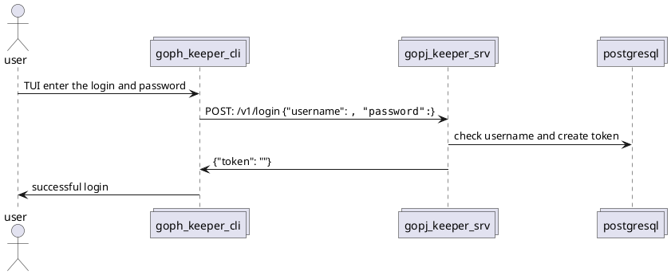
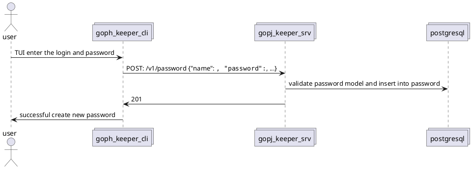

## Описание системы
```plantuml
@startuml
!include https://raw.githubusercontent.com/plantuml-stdlib/C4-PlantUML/master/C4_Container.puml

LAYOUT_WITH_LEGEND()
LAYOUT_LANDSCAPE()

title
  <b>GophKeeperArch v2024.02.17</b>
  <i>Управление паролями GophKeeper</i>
end title

Person(user, "Пользователь")
System(goph_keeper, "Менеджер паролей")

Rel(user, goph_keeper, "Создание\получение\удаление паролей", "Text-User Interface")

@enduml
```

## Описание контейнеров
```plantuml
@startuml
!include https://raw.githubusercontent.com/plantuml-stdlib/C4-PlantUML/master/C4_Container.puml

LAYOUT_WITH_LEGEND()
LAYOUT_TOP_DOWN()

title
  <b>GophKeeperContainers v2024.02.17</b>
  <i>Описание контейнеров GophKeeper</i>
end title

Person(user, "Пользователь")
System_Boundary(password_managing_desktop, "Клиент системы хранения паролей") {
  Container(goph_keeper_cli, "Менеджер паролей")
  Rel(user, goph_keeper_cli, "Создание\получение\удаление паролей", "Text-User Interface")
}

System_Boundary(passmword_managing_server, "Сервер системы хранения паролей") {
  Container(goph_keeper_server, "Сервер хранения паролей")
  ContainerDb(db, "База данных", "PostgreSQL", "Хранит пользователей, сессии, пароли и т.д.", "")
  Rel_D(goph_keeper_cli, goph_keeper_server, "Запросы к серверу", "HTTP")
  Rel_D(goph_keeper_server, db, "Чтение\Запись")
}

@enduml
```

## Описание компонентов
```plantuml
@startuml
!include https://raw.githubusercontent.com/plantuml-stdlib/C4-PlantUML/master/C4_Container.puml

LAYOUT_WITH_LEGEND()
LAYOUT_TOP_DOWN()

title
  <b>GophKeeperComponents v2024.02.17</b>
  <i>Описание компонентов GophKeeper</i>
end title

@enduml
```

### Регистрация пользователя


### Аутентификация пользователя


### Создание записи с паролем
